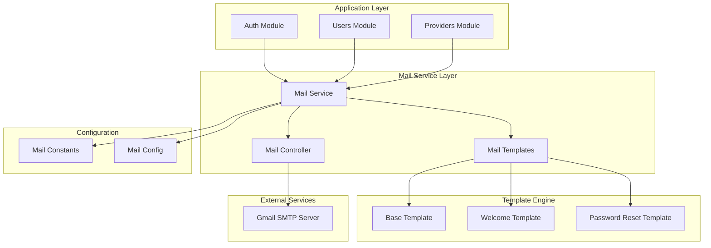
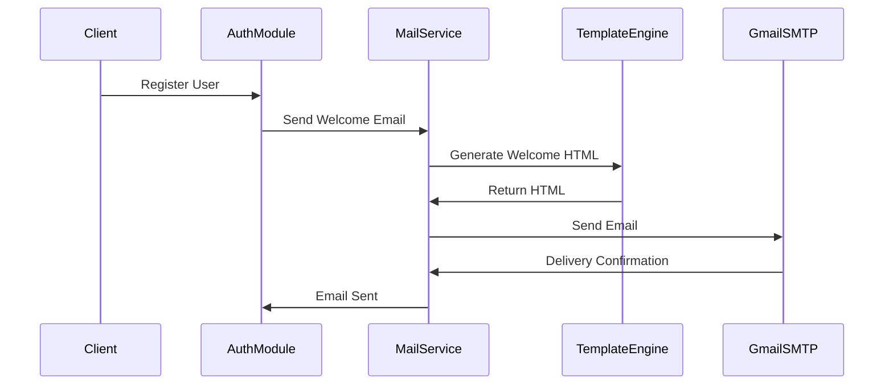
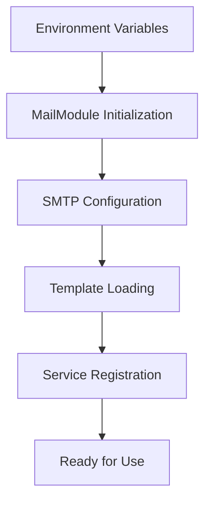
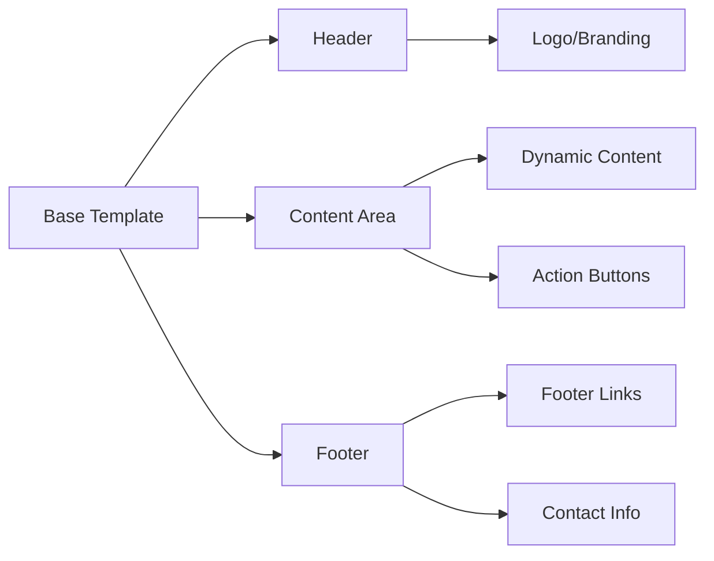

# Email Service - Technical Specification

## System Architecture

## Component Relationships

## Configuration Flow

## Email Template Structure

## Implementation Steps

1. **Mail Module Creation**
   - Create mail module structure
   - Configure NestJS module dependencies
   - Set up service providers

2. **SMTP Configuration**
   - Environment variable setup
   - Gmail app password configuration
   - Connection testing

3. **Template System**
   - Base template creation
   - Specific email templates
   - HTML/CSS styling

4. **Service Integration**
   - Core mail service implementation
   - Error handling and retry logic
   - Logging and monitoring

5. **Testing Implementation**
   - Unit tests for mail service
   - Integration tests
   - Email delivery testing

6. **Documentation**
   - Setup instructions
   - Usage examples
   - Troubleshooting guide